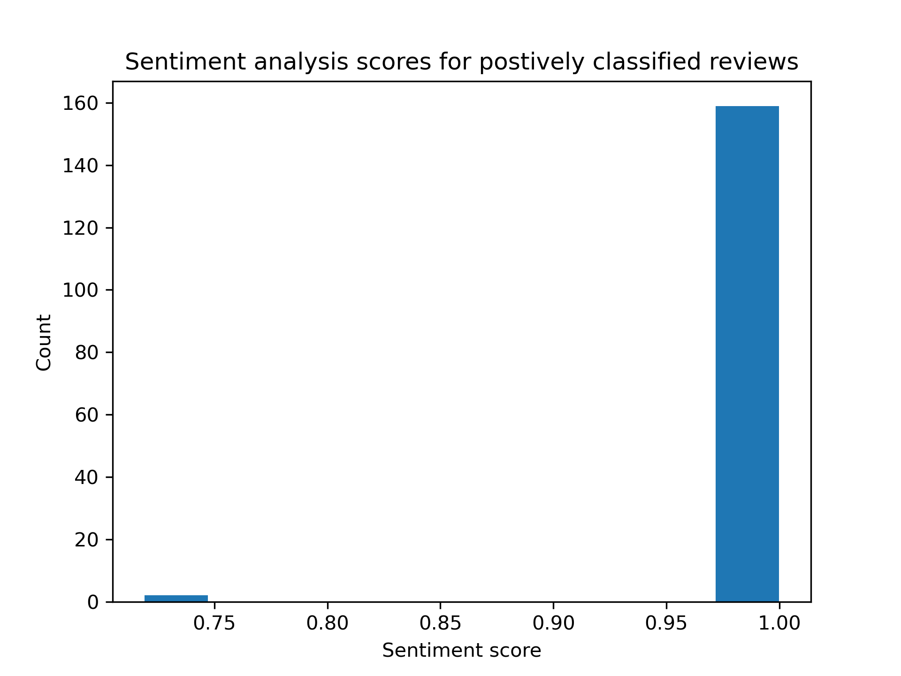

   # Saving Bachata Exchange

The following work is a personal project I created using my skills in Natural Language Processing (NLP) using the [Transformer package](https://huggingface.co/) in response to help a campaign aimed at saving one of my favorite local dance events called Bachata Exchange in London. My contribution involved using NLP methods to collate and express the positive value of the event, as evidenced by the overwhelmingly positive reviews from its patrons.

## File structure

- BE_sentiment_analysis
   - README.md: The file your reading.
   - descriptive.py: analysis file to calculate descritive of sentiment analyses
   - transformer.py: sentiment analysis pipeline using the transformer api and the distilbert-base-uncased-finetuned-sst-2-english pretrained model.
   - vader_scores.py: sentiment anlaysis using Vader scores
   - vis.py: file to produce analysis visualisations.
- data
   - reviews.csv: CSV file of TripAdvsior review scraped from scrapeHero Cloud.
   - tranformers_analysis_result.csv updated CSV from the reviews.csv file with the distilbert-base-uncased-finetuned-sst-2-english sentiment analysis results.
   - vader_analysis_results.csv: updated CSV from the reviews.csv file with the vader score sentiment analysis results.
   - negativereview.txt: text file of only negative reviewof the event.
- vis
   - starbar.png 
   - word_cloud.png  

# Data Scraping
The first step of the project was to scrape the data from tripadvisor. To do this I used a service called [scrapeHero Cloud](https://cloud.scrapehero.com/crawlers) to scrape the reviews from Bachata exchanges' associated TripAdvisor (at time of 15/07/2024) page [see](https://www.tripadvisor.co.uk/Attraction_Review-g186338-d26663269-Reviews-Bachata_Exchange-London_England.html).

## Numerical reviews assessment

1. 161 reviews at time of analysis were availible and scraped from TripAdvisor.
2. The average length of a review was 71 words long.

## Star ratings

Fig 1: Barplot showing the distribution of rarings with their associated count for the Bachata Exchange tripadvisor reviews.

# NLP analyses

## Wordcloud

Fig 2: Wordcloud generated on the non-event (removal of reference to location or day) specific words.

The results of the word cloud indicate that the reviews are positive, particularly highlighting the focus on people, community, and the social benefits that the Bachata Exchange event brings to its patrons. This event, offered at no cost, significantly enhances the social capital in the lives of its participants. This is especially noteworthy considering the declining social capital within the UK.(see, [office of national statistics](https://www.gov.uk/government/statistics/social-capital-in-the-uk-2022)) Additionally, as Dederichs (2024) points out, many individuals can be economically barred from participating in such community-building activities. Therefore, the free status of the event is incredibly valuable, as it ensures inclusivity and accessibility for everyone, regardless of their economic situation.
## Transformer sentiment analysis

The sentiment analysis here is based on the results of the distilbert-base-uncased-finetuned-sst-2-english text classification neural network. The model identifies the sentiment of text, classifying it as either positive or negative.

Fig 3: Histogram  of the 160  positively sentiment classfied TripAdvisor reviews. 

Results.
1. 160 one of the TripAdvsior reviews have been classified as positive sentiment.
2. As Fig 3. shows there ovelingly high postive sentiment given to Bahcata Excahgne in its reviews.
3. The negative sentiment classification is a example of misclassaificaiton of the model. 
 if evaualted by a human: "A fantastic event! Free classes at different levels with great teachers. At present the classes are not available and I'm really missing them. A great place to learn something new and meet friendly fun loving people! Bring it back!" This only review classified as negative sentiment, but was one of the many 5 star ratings of Bachata Exchange.

# Success
Overall, the efforts invested by various individuals to save Bachata Exchange were successful, with its return to the London dance scene confirmed.

# References
Dederichs, K. (2024). Join to connect? Voluntary involvement, social capital, and socioeconomic inequalities. Social Networks, 76, 42-50.
