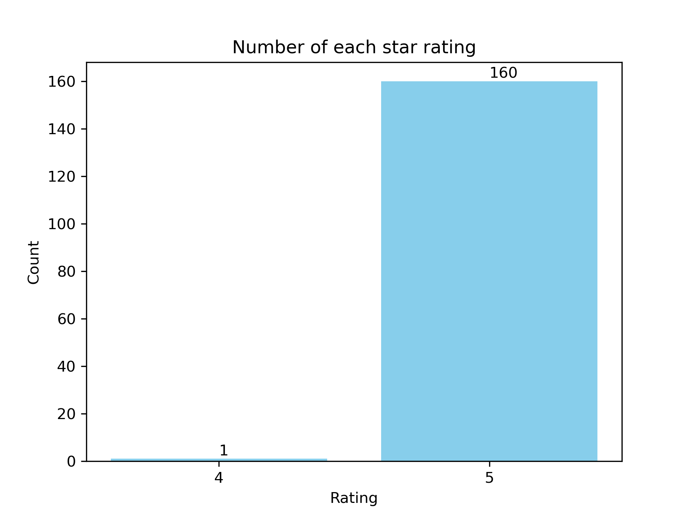
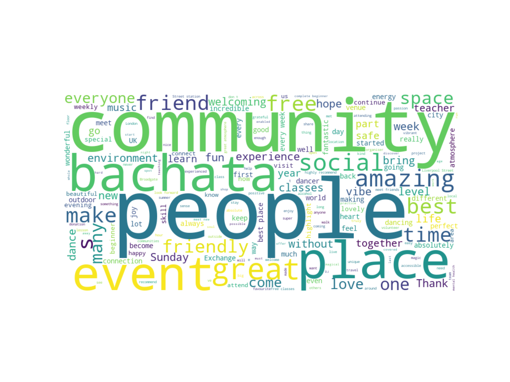

   # Saving Bachata Exchange

The following work is a personal project I created using my skills in Natural Language Processing (NLP) in  response to help a campaign aimed at saving one of my favorite local dance events called Bachata Exchange in London. My contribution involved using NLP methods to collate and express the positive value of the event, as evidenced by the overwhelmingly positive reviews from its patrons.

## File structure

- BE_sentiment_analysis
   - README.md: The file your reading.
   - descriptive.py: analysis file to calcuate descritive of sentiment analyses
   - transformer.py: sentiment analysis pipeline using the transformer api and the distilbert-base-uncased-finetuned-sst-2-english pretrained model.
   - vader_scores.py: sentiment anlaysis using Vader scores
   - vis.py: file to produce analysis visualisations.
- data
   - reviews.csv: CSV file of TripAdvsior review scraped from scrapeHero Cloud.
   - tranformers_analysis_result.csv updated CSV from the reviews.csv file with the distilbert-base-uncased-finetuned-sst-2-english sentiment analysis results.
   - vader_analysis_results.csv: updated CSV from the reviews.csv file with the vader score sentiment analysis results.
- vis
   - starbar.png 
   - word_cloud.png  

# Data Scraping
The first step of the project was to scrape the data from tripadvisor. To do this I used a service called [scrapeHero Cloud](https://cloud.scrapehero.com/crawlers) to scrape the reviews from Bachata exchanges' associated TripAdvisor page [see](https://www.tripadvisor.co.uk/Attraction_Review-g186338-d26663269-Reviews-Bachata_Exchange-London_England.html).

## Numerical reviews assessment

1. 161 reviews at time of analysis were availible and scraped from TripAdvisor.
2. The average length of a review was 71 words long.

## Star ratings

Fig 1: Barplot showing the distribution of rarings with their associated count for the Bachata Exchange tripadvisor reviews.

# NLP analyses

## Wordcloud

Fig 2: Wordcloud generated on the non-event (removal of reference to location or day) specific words.

Results of wordcloud shows that the reviews are positive but specifcally with focus on people, community and the social benefits that the Bachata Exchnge event adds to its patrons lives all for free. This can be presented as net benefit of social capital in the patrons lives which is ever decreasing witin the UK (see, [office of national statistics](https://www.gov.uk/government/statistics/social-capital-in-the-uk-2022)) and which individuals can be economically Barred (Dederichs, 2024) from and why free status of the event is so valuable.

## Transformer sentiment analysis

The sentiment analysis here is based of the results of distilbert-base-uncased-finetuned-sst-2-english text classifcation neural network. 

# Success
Overall the efforts invested by the various individuals to save Bachata Exchange were succesful with its return to the London dance scene confirmed. The model indenifies the sentiment of text classfying it as either postive or negative in sentiment.

# References
Dederichs, K. (2024). Join to connect? Voluntary involvement, social capital, and socioeconomic inequalities. Social Networks, 76, 42-50.
